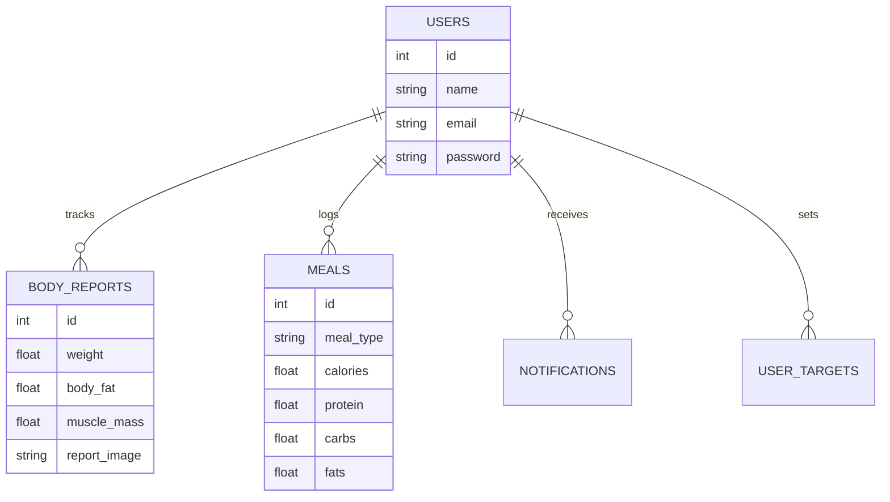

# 🍏 Healthify Backend API

[](https://laravel.com)
[](https://php.net)
[](https://docker.com)
[](https://mysql.com)

Welcome to the **Healthify Backend API**, the high-performance engine powering the Healthify ecosystem. This project is a robust, scalable, and AI-integrated health management platform designed to track body composition, manage nutrition, and provide personalized health insights.

---

## 🏛️ Project Architecture

We follow a modern, decoupled architecture to ensure maintainability and testability. The system is built on **Laravel 13** and adheres to **SOLID** principles.

### The Action/Service Pattern
Instead of bloated controllers, we isolate business logic into:
- **Actions**: Single-purpose classes (e.g., `CreateUserAction`, `ProcessInBodyAnalysis`) that represent a single unit of work.
- **Services**: Classes that handle complex business logic or external integrations (e.g., `AIAnalyzerService`).
- **Repositories**: A data access layer that abstracts Eloquent queries, ensuring data integrity and easy testing.

### Why this architecture?
- **Single Responsibility**: Each class does exactly one thing.
- **Reusability**: Actions can be triggered from Controllers, CLI commands, or Jobs.
- **Testability**: Logic is separated from the HTTP layer, making Unit Testing seamless.

---

## 🚀 Environment Setup

### Option 1: Running with Docker (Recommended)
The system is fully containerized and orchestrated with Docker Compose.

1. **Clone the repository** and navigate to the backend directory.
   ```bash
   git clone https://github.com/YUSEF-RAMY/Healthify

   cd Healthify/Backend
   ```
2. **Spin up the Containers**:
   ```bash
   docker compose up -d --build
   ```
   *The entrypoint script will automatically handle: `.env`, `composer install`, `key:generate`, `migrate`, and `storage:link`.*

### Option 2: Local Development
1. Install dependencies: `composer install`
2. set enviroment variables: `cp .env.example .env`.
3. generate key: `php artisan key:generate`
4. storage link: `php artisan storage:link`
5. Run migrations: `php artisan migrate --seed`
6. Start the server: `php artisan serve`

---

## 🤖 AI Integration
Healthify features a deep integration with a **FastAPI-based AI Service** using YOLOv8 for InBody report extraction.
- **Service Bridge**: `App\Services\AI\AIAnalyzerService` handles the multipart/form-data communication via Laravel's `Http` client.
- **Workflow**: 
  1. User uploads InBody image.
  2. Backend sends image to AI Service.
  3. AI Service returns JSON data (Weight, Body Fat, Muscle Mass, etc.).
  4. Backend persists data and triggers personalized recommendations.

---

## 📊 Database Schema Overview



---

## 📡 API Standards & Response Format
We follow **RESTful** standards. All responses are returned in a unified JSON structure for frontend consistency.

### Unified Response Format:
```json
{
    "success": true,
    "message": "Resource retrieved successfully",
    "data": { ... },
    "errors": null
}
```

### Core Endpoints:
| Method | Endpoint | Description |
| :--- | :--- | :--- |
| `POST` | `/api/register` | User Registration |
| `POST` | `/api/login` | Authentication (Sanctum) |
| `POST` | `/api/inbody/analyze` | AI Image Analysis |
| `GET` | `/api/foods/daily-summary` | Nutritional Summary |
| `POST` | `/api/nutrition-plan` | AI Nutrition Generation |

---

## 🐳 Dockerization Details
Our environment consists of three primary services:
- **healthify-backend-api**: PHP 8.4-FPM container with optimized layer caching.
- **healthify-db**: MySQL 8.0 with persistent volume for data integrity.
- **healthify-nginx**: Configured as a Reverse Proxy for the Backend and AI Service.

---

## 🛠️ Development Commands

| Task | Command |
| :--- | :--- |
| **Clear Cache** | `php artisan optimize:clear` |
| **Run Migrations** | `php artisan migrate` |
| **Database Seeding** | `php artisan db:seed` |
| **Check Routes** | `php artisan route:list` |

---

## 🔒 Security
- **Authentication**: Managed via **Laravel Sanctum** using Bearer Tokens.
- **Validation**: Strict validation rules in Form Requests to prevent SQL injection and XSS.
- **Authorization**: Policies and Gates ensure users can only access their own data.

---

## Deployed By

<div align="center">
  <h3>Backend & Devops Architected with ❤️ by <a href="https://github.com/YUSEF-RAMY">Yusef Ramy</a></h3>
<p align="center">
  <a href="https://github.com/YUSEF-RAMY" target="_blank">
    
  </a>
  <a href="https://www.linkedin.com/in/yusef-ramy/" target="_blank">
    
  </a>
  <a href="https://yusef-ramy.vercel.app" target="_blank">
    
  </a>
</p>
</div>
